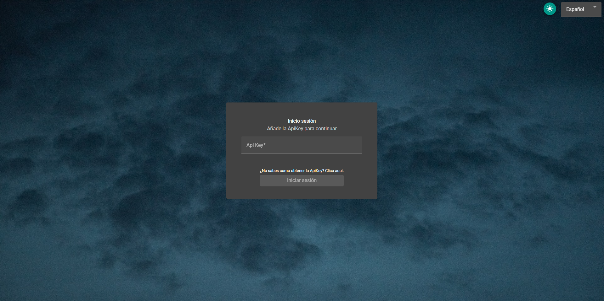
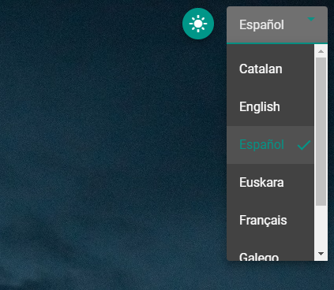
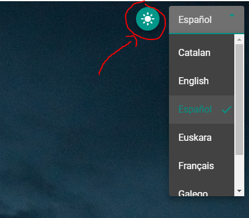
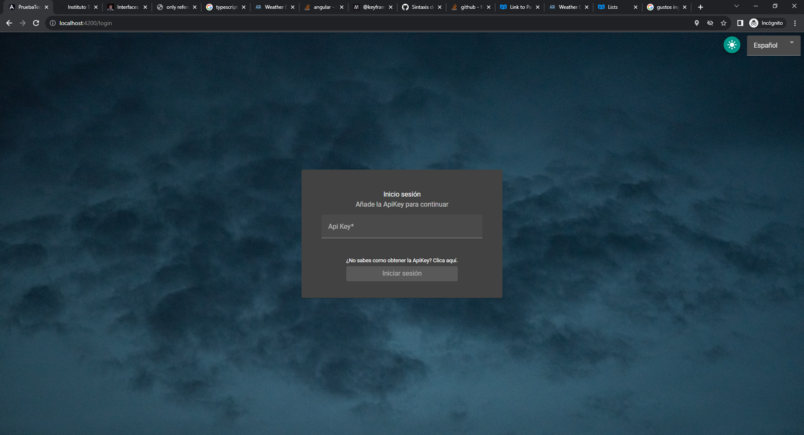
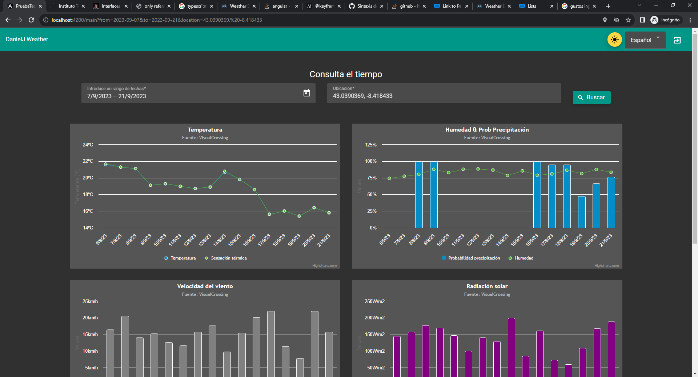
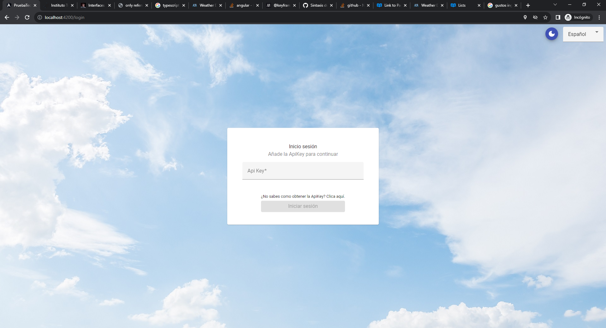
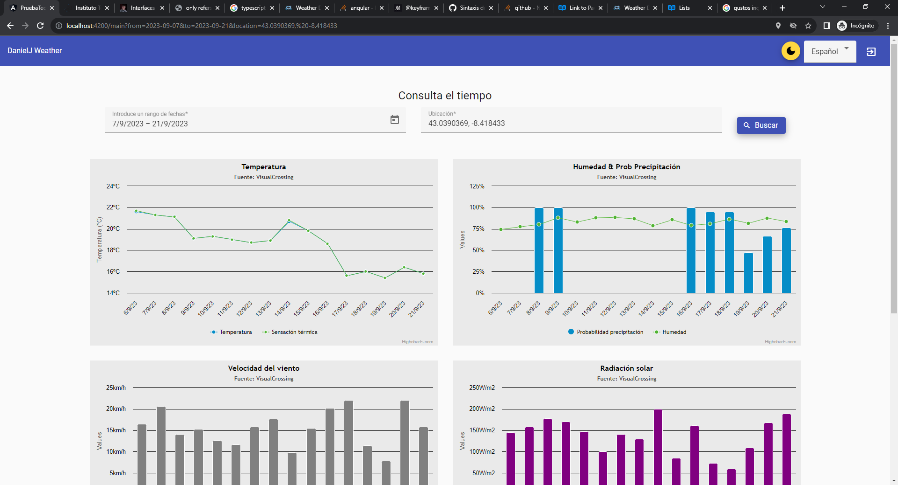
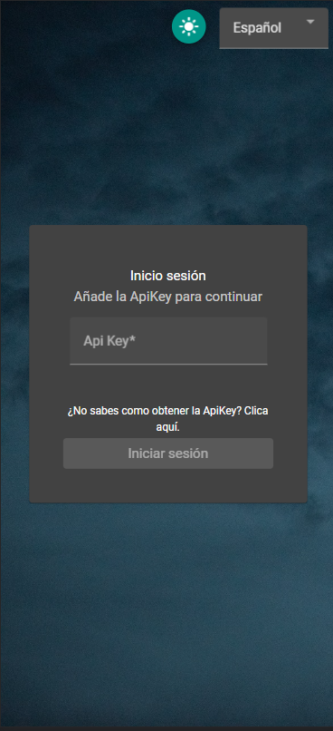
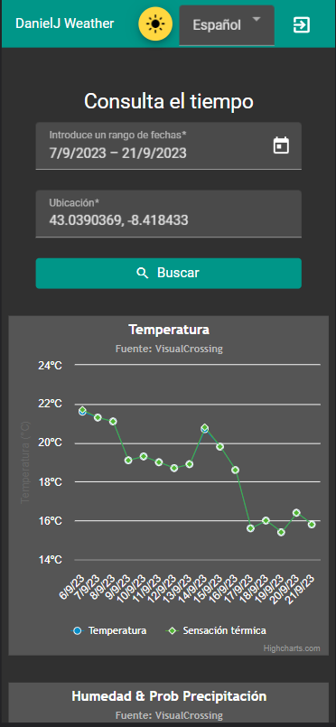

# PRUEBA TÉCNICA ITG

### Contents Table
1. [ How to execute. ](#execute)
2. [ How to get API KEY. ](#api-key)
3. [ Features. ](#features)
    1. [ Languages ](#languages)
    2. [ Dark mode ](#dark-mode)
    3. [ Animations ](#animations)
    4. [ Responsiveness ](#responsiveness)
4. [ Deploy in a server](#deploy-server)
5. [ Contact ](#contact)

<a id="execute"></a>
## 1. How to execute
With node and npm properly installed, you can install the packages needed to compile the project using the following command:
```
npm install
```
Once installed, you can execute the code with:
```
ng serve
```
But if you want to compile it in order to deploy in a WebServer like Apache Tomcat or nginx, the command needed is:
```
ng build
```

<a id="api-key"></a>
## 2. How to get API KEY
You can make the webpage working properly without the api server (using mocked data) by changing the variable ```environment.USE_MOCK_DATA = true```.  
In order to get the API KEY needed to execute the WebPage with real data, you need to register in [VisualCrossing](https://www.visualcrossing.com/weather/weather-data-services), this key must be passed in the Login prompt in our page.


<a id="features"></a>
## 3. Features
<a id="languages"></a>
### 3.1. Languages
You can use the web in different languages, specifically:

- Spanish
- English
- Catalan
- Galician
- Euskera
- French
- Portuguese

I would like to highlight that locale dates are showed depending on Lang used (```dd/MM/yyyy``` when ```'es'```, ```MM/dd/yyyy``` when ```'en'```)
By default, the language used is the once of the browser or the last selected by the user.


<a id="dark-mode"></a>
### 3.2. Dark mode
You can change between dark and light mode depending on what you prefer.
By default, the mode used is the same of the system.



This is the dark mode:



This is the light mode:



<a id="animations"></a>
### 3.3. Animations
There are also animations between Login and Main pages and fadein/fadeout when changing between dark and light modes.

<a id="responsiveness"></a>
### 3.4. Responsiveness
The web is completely responsive, Login and Main pages, Charts and tables adapt properly to mobile devices with small screens.




<a id="deploy-server"></a>
## 4. Deploy in a server
If you want to install the webpage easily in a server or just run it in your local machine in a virtual environment, you just need to run on the server inside this directory the following command:

```docker compose up```

<a id="contact"></a>
## 4. Contact
If you need help or have any suggestions, please contact [daniel.delrio.juncal@gmail.com](mailto:daniel.delrio.juncal@gmail.com)
